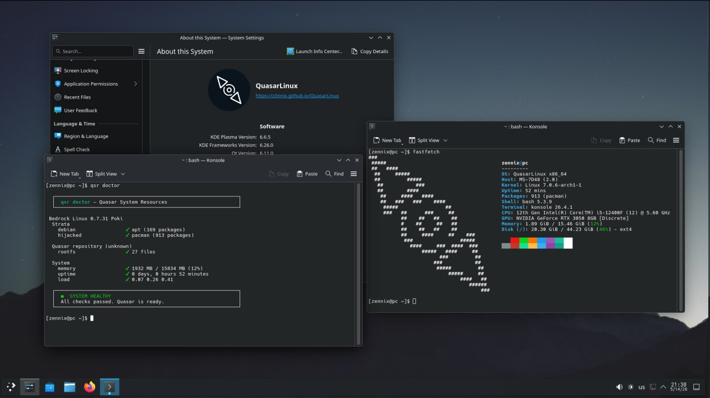

[](https://www.gnu.org/licenses/gpl-3.0)
[](https://github.com/z3nnix/QuasarLinux)
# QuasarLinux

**One system. Two worlds. No containers.**

Quasar is a meta-distribution that runs Arch and Debian side by side — not in VMs, not in chroots, but natively on the same filesystem. Need a package that isn't in Arch? Pull it from Debian. Want a rock‑stable base with fresh apps from Arch? Flip the default stratum.

 <br>
_This is [zennix](https://github.com/z3nnix)'s daily desktop btw_
---

## The Problem

- Arch is great — until a package isn't in the repos or AUR (or you just don't want to build from source).
- Debian is stable — until you need a newer version of something.
- Containers work, but they're heavy, isolated, and annoying for everyday CLI tools.

**Quasar solves this**: your shell sees one system, `qsr` decides where to grab the package from. No `docker run`, no `chroot`, no manual AUR builds.

---

## System Requirements

| Component | Minimum | Comfortable |
|-----------|---------|-------------|
| RAM       | 1 GB    | **4+ GB**   |
| Disk      | 8 GB    | **32+ GB**  |
| CPU       | 1 core, 1 GHz | 2+ cores, 2+ GHz |

*Let's be honest — Quasar isn't meant for weak PCs. Give it room to breathe.*

## Installation (Two Reboots, That's Normal)

### Stage 1 — Live ISO
1. [Download the ISO](https://github.com/z3nnix/QuasarLinux/releases/tag/release) and write it to a USB.
2. Boot into the ISO, connect to the internet.
3. Run:
   ```bash
   quasarinstall
   ```
   **Important:** On the final screen, choose *"exit quasarinstall"* (simple exit). This passes the post‑install script correctly.
4. Reboot.

### Stage 2 — Post‑Install
- You'll see Arch branding (not a mistake — installation isn't done yet).
- Log in as `root` and run:
  ```bash
  quasarify
  ```
- Follow the instructions, then reboot again.

**Done.** Quasar greets you.

---

## First Steps After Installation

Update everything (also verifies QSR is installed):

```bash
sudo qsr update
```

If `qsr` is missing (e.g., after a manual install), see [FAQ](#faq).

---

## What Is QSR?

**QSR** (Quasar System Resource) is a meta‑package manager. It doesn't replace `pacman` or `apt` — it manages them.

- `qsr` → shows available commands
- `sudo qsr install <package>` → installs from the primary stratum (Arch)
- `sudo qsr install deb:<package>` → forces Debian
- `sudo qsr doctor` → checks system health

---

## Who Is This For?

- You're tired of Linux fragmentation and just want packages to work.
- You want access to a *larger* part of the ecosystem without switching distros.
- You don't mind occasional rough edges (this is experimental, after all).

### What If I Want Debian as My Base?

Out of the box, Arch is primary (fresh packages). You can change stratum priority — documentation example coming soon. Make Debian your base for stability, then pull fresh apps from Arch when needed.

---

## FAQ
See [FAQ](https://github.com/z3nnix/QuasarLinux/blob/main/handbook/en/6.0-FAQ.md), or [if you speak russian](https://github.com/z3nnix/QuasarLinux/blob/main/handbook/ru/6.0-%D0%A7%D0%B0%D1%81%D1%82%D1%8B%D0%B5-%D0%B2%D0%BE%D0%BF%D1%80%D0%BE%D1%81%D1%8B.md)

## Status

**Experimental.** Works, but automatic package selection isn't implemented yet. You'll use `deb:` manually for now. Strata definition is hardcoded (Arch + Debian). Future versions will be more flexible.

---

## License

GPLv3. Because sharing is caring <3